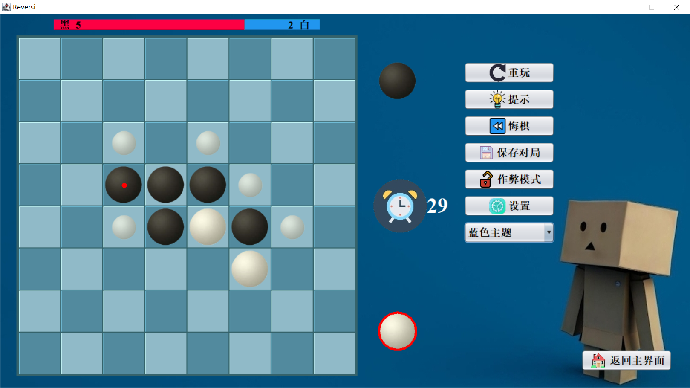

# Reversi (Othello)

[**English**](./README.md) | [**中文简体**](./README_zh-CN.md)

Developed visually appealing and multifunctional Othello through the graphical framework Swing.

## Features:

- **Pure Java & Swing Architecture:** The Reversi game stands on the reliable and widely-supported foundations of Java and Swing, ensuring compatibility and a smooth user experience.
- **Visually Appealing Interface:** With a focus on aesthetics, we've designed a user interface that is not just functional but also pleasing to the eyes, enhancing your gameplay.
- **Versatile Gameplay Options:**
  - **Two-Player Duel:** Challenge a friend to a classic head-to-head battle of wits.
  - **Player vs. AI:** Test your skills against various levels of AI opponents.
  - **Load Game Feature:** Pick up right where you left off or analyze past games.
- **User-Friendly Experience:**
  - **Feedback System:** Receive immediate game responses and suggestions.
  - **Rule Introduction:** New to Reversi? Learn the ropes with the integrated guide.
  - **Mistake Protection:** Undo accidental moves easily.
  - **Game Continuity Alerts:** Get notified about unfinished games.
  - **Step Recall:** Strategically reconsider your moves by going back steps.
  - **Bot Assistant:** Utilize AI assistant for game insights and tips.
- **Customization Galore:**
  - **Sound Settings:** Adjust flipping and background sounds to your liking.
  - **Flip Animation:** Choose your preferred visual effects for piece flipping.
  - **Themes:** Change the game's look with various visual themes.
- **Challenging AI Levels:** Whether you're a beginner or a seasoned player, AI can match your skill level, offering a good challenge to all players.

